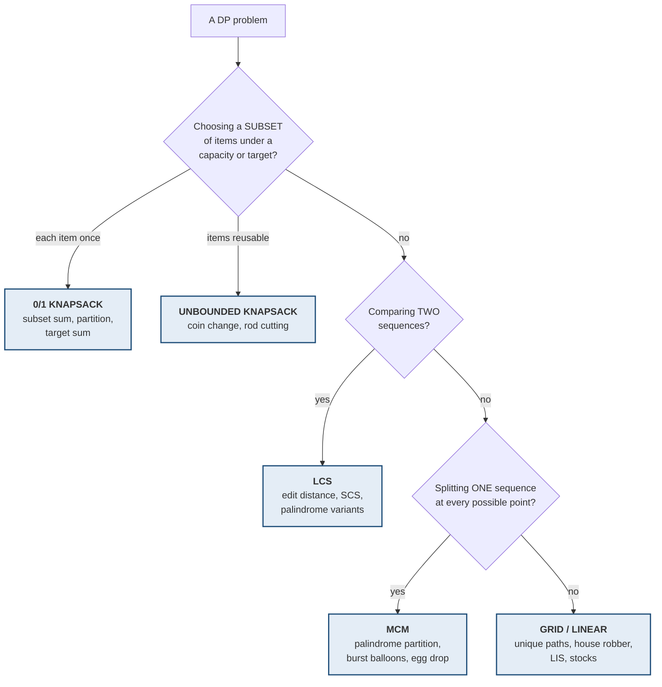

# DP — the five parent patterns

> **The reason DP feels infinite is that it is taught problem by problem.** It
> is not infinite. Roughly five parent problems generate almost everything
> asked, and each child differs from its parent by one or two lines.
>
> **Learn five recurrences properly and you have forty problems.**

> **Source note.** This pattern grouping is
> [Aditya Verma's](https://www.youtube.com/@TheAdityaVerma) framing from his DP
> playlist; the structure was cross-checked against a public repository of
> solutions to that series. **The code below is mine and every implementation
> was executed against test cases** — see the note at the end.

---

## 1 · Identification — which parent is this?



| Cue in the problem | Parent |
|---|---|
| "pick some items", "each used **once**", a target or capacity | **0/1 knapsack** |
| "unlimited supply", "**reuse** allowed", "infinite coins" | **Unbounded knapsack** |
| **Two** strings or arrays compared | **LCS** |
| One sequence, "try **every** split point", cost of combining | **MCM** |
| Move through a grid, or one array with a running choice | **Grid / linear** |

---

```sim
dsadppatterns
```

---

## 2 · Parent 1 — 0/1 knapsack

**The recurrence every child inherits:**

```
For each item, TWO choices: take it (if it fits) or skip it.

    dp[i][w] = max( dp[i-1][w],                        skip
                    val[i-1] + dp[i-1][w - wt[i-1]] )  take
```

```python
def knapsack(wt, val, W):
    n = len(wt)
    dp = [[0] * (W + 1) for _ in range(n + 1)]
    for i in range(1, n + 1):
        for w in range(W + 1):
            dp[i][w] = dp[i-1][w]                       # skip
            if wt[i-1] <= w:                            # take, if it fits
                dp[i][w] = max(dp[i][w], val[i-1] + dp[i-1][w - wt[i-1]])
    return dp[n][W]
```

**Space-optimised to 1D — and the loop direction is the entire trick:**

```python
def subset_sum(nums, target):
    dp = [False] * (target + 1)
    dp[0] = True                     # sum 0 is always reachable: take nothing
    for x in nums:
        for t in range(target, x - 1, -1):    # BACKWARD -- see below
            dp[t] = dp[t] or dp[t - x]
    return dp[target]
```

> **Iterate backwards for 0/1, forwards for unbounded.** Going backwards means
> `dp[t-x]` still holds the value from *before* this item was considered, so the
> item is used at most once. Going forwards, `dp[t-x]` may already include this
> item — which is exactly what unbounded wants and 0/1 must avoid.
>
> **That one word — backward or forward — is the whole difference between the
> two parents.** It is also the most common silent bug in DP code, because both
> versions run and only one is right.

### The children

| Problem | What changes from the parent |
|---|---|
| **Subset sum** (can we hit a target?) | `max` → `or`; values become booleans |
| **Equal sum partition** (LC 416) | Sum must be even; ask subset-sum for `sum/2` |
| **Count subsets with a given sum** | `or` → `+`; `dp[0] = 1` instead of `True` |
| **Minimum subset-sum difference** | Find the largest reachable `t ≤ sum/2`; answer is `sum − 2t` |
| **Target sum** (LC 494) | Signs `+`/`−` reduce to counting subsets summing to `(S+target)/2` |
| **Partition to k equal subsets** (LC 698) | Bitmask over used elements — see [bit manipulation](bit-manipulation.html) |

**The target-sum reduction is worth deriving once**, because it looks like a
different problem entirely:

```
Split the numbers into P (given +) and N (given -).
    P - N = target        and       P + N = S
    => 2P = S + target    =>        P = (S + target) / 2

So "assign + and - to reach target" IS "count subsets summing to (S+target)/2".
If (S + target) is odd, the answer is 0 -- no such split exists.
```

**Verified:** `target_sum([1,1,1,1,1], 3) == 5`.

---

## 3 · Parent 2 — unbounded knapsack

**Same shape, one change: after taking an item you may take it again.**

```
    dp[i][w] = max( dp[i-1][w],                      skip -> move on
                    val[i-1] + dp[i][w - wt[i-1]] )  take -> STAY on i
```

```python
def unbounded_knapsack(wt, val, W):
    dp = [0] * (W + 1)
    for w in range(1, W + 1):
        for i in range(len(wt)):
            if wt[i] <= w:
                dp[w] = max(dp[w], val[i] + dp[w - wt[i]])
    return dp[W]
```

### The children

| Problem | Change |
|---|---|
| **Rod cutting** | Lengths are the weights, prices the values, rod length the capacity |
| **Coin change — count ways** (LC 518) | `max` → `+` |
| **Coin change — min coins** (LC 322) | `max` → `min`, init `INF`, take `1 + dp[...]` |

**The loop-order trap in coin change — this is asked constantly:**

```python
def coin_change_ways(coins, amount):
    dp = [0] * (amount + 1)
    dp[0] = 1
    for c in coins:                        # COIN outer
        for t in range(c, amount + 1):     # amount inner
            dp[t] += dp[t - c]
    return dp[amount]
```

> **Coin outer, amount inner → counts COMBINATIONS.** `{1,2}` and `{2,1}` are
> one way. **Swap the loops** — amount outer, coin inner — **and you count
> PERMUTATIONS**, where those are two ways.
>
> Both compile, both run, both look reasonable. **The nesting order silently
> decides which question you answered.** Verified: `coin_change_ways([1,2,5], 5)
> == 4` — combinations, as intended.

---

## 4 · Parent 3 — LCS

**The largest family by far.** Two sequences; match or skip.

```
    if a[i-1] == b[j-1]:  dp[i][j] = 1 + dp[i-1][j-1]        characters match
    else:                 dp[i][j] = max(dp[i-1][j], dp[i][j-1])
```

```python
def lcs(a, b):
    m, n = len(a), len(b)
    dp = [[0] * (n + 1) for _ in range(m + 1)]
    for i in range(1, m + 1):
        for j in range(1, n + 1):
            if a[i-1] == b[j-1]:
                dp[i][j] = dp[i-1][j-1] + 1
            else:
                dp[i][j] = max(dp[i-1][j], dp[i][j-1])
    return dp[m][n]
```

### The children — nine problems from one recurrence

| Problem | Change from LCS |
|---|---|
| **Longest common SUBSTRING** | On mismatch set `dp[i][j] = 0` instead of taking a max; track the running best |
| **Print the LCS** | Walk the table backwards from `dp[m][n]` |
| **Shortest common supersequence** | `len(a) + len(b) − lcs(a,b)` |
| **Min insertions + deletions** | deletions `= len(a) − lcs`, insertions `= len(b) − lcs` |
| **Longest palindromic subsequence** | `lcs(s, reversed(s))` |
| **Min deletions to make a palindrome** | `len(s) − lps(s)` |
| **Min insertions to make a palindrome** | The same number — `len(s) − lps(s)` |
| **Longest repeating subsequence** | `lcs(s, s)` with the added condition `i != j` |
| **Sequence pattern matching** | `lcs(a,b) == len(a)` |

> **`lps(s) = lcs(s, reverse(s))` is the single highest-leverage identity in DP.**
> It turns four separate "palindrome" problems into the one recurrence you
> already know. Verified: `lps("bbbab") == 4`.

**The substring-vs-subsequence difference is one line**, and it is worth being
able to state instantly:

```python
if a[i-1] == b[j-1]:
    dp[i][j] = dp[i-1][j-1] + 1
# SUBSEQUENCE: else dp[i][j] = max(dp[i-1][j], dp[i][j-1])   -- may skip
# SUBSTRING:   else dp[i][j] = 0                             -- must be contiguous
```

**Edit distance** (LC 72) is the same family with three choices instead of two —
insert, delete, replace — and is worth doing right after LCS while the shape is
fresh.

---

## 5 · Parent 4 — MCM

**One sequence, and you try every split point.** The recurrence has a third
loop, which is what makes it O(n³).

```
    for every split k between i and j:
        dp[i][j] = min( dp[i][k] + dp[k+1][j] + cost_of_combining(i,k,j) )
```

```python
def mcm(dims):
    n = len(dims)
    dp = [[0] * n for _ in range(n)]
    for length in range(2, n):                  # by INCREASING interval length
        for i in range(1, n - length + 1):
            j = i + length - 1
            dp[i][j] = float('inf')
            for k in range(i, j):               # every split point
                dp[i][j] = min(dp[i][j],
                               dp[i][k] + dp[k+1][j] + dims[i-1]*dims[k]*dims[j])
    return dp[1][n-1]
```

> **Iterate by interval length, not by index.** `dp[i][j]` depends on strictly
> shorter intervals, so they must be computed first. Looping `i` and `j`
> naively reads uninitialised cells — another bug that runs and returns
> nonsense.

### The children

| Problem | The "cost of combining" |
|---|---|
| **Palindrome partitioning** (LC 132) | 1 cut, if the piece is a palindrome |
| **Burst balloons** (LC 312) | `nums[i-1] * nums[k] * nums[j+1]` — the *last* balloon burst |
| **Evaluate expression to true** | Count over the operator at the split |
| **Egg dropping** | `1 + max(broken, survived)` over each floor |
| **Boolean parenthesisation** | Count `(true, false)` pairs per split |

**Egg drop with the binary-search optimisation** — the naive version is O(e·f²):

```python
def egg_drop(eggs, floors):
    dp = [[0] * (floors + 1) for _ in range(eggs + 1)]
    for f in range(1, floors + 1):
        dp[1][f] = f                       # one egg: linear search, worst case f
    for e in range(2, eggs + 1):
        for f in range(1, floors + 1):
            dp[e][f] = float('inf')
            lo, hi = 1, f
            while lo <= hi:                # broken increases, survived decreases
                k = (lo + hi) // 2         # -> binary search the crossover
                broke, survived = dp[e-1][k-1], dp[e][f-k]
                dp[e][f] = min(dp[e][f], 1 + max(broke, survived))
                if broke < survived: lo = k + 1
                else:                hi = k - 1
    return dp[eggs][floors]
```

**Verified:** `egg_drop(2, 100) == 14`, `egg_drop(2, 10) == 4`, `egg_drop(3, 14) == 4`.

> **The binary search works because the two terms are monotonic in opposite
> directions** — `dp[e-1][k-1]` rises with `k` while `dp[e][f-k]` falls. You are
> searching for the crossover, which is the classic
> [binary search on the answer](binary-search.html) idea inside a DP.

---

## 6 · Parent 5 — grid and linear

The most familiar, already covered on the
[dynamic programming](dynamic-programming.html) page.

| Problem | Recurrence |
|---|---|
| Climbing stairs / Fibonacci | `dp[i] = dp[i-1] + dp[i-2]` |
| House robber | `dp[i] = max(dp[i-1], dp[i-2] + nums[i])` |
| Unique paths | `dp[i][j] = dp[i-1][j] + dp[i][j-1]` |
| Min path sum | `dp[i][j] = grid[i][j] + min(up, left)` |
| LIS | `dp[i] = 1 + max(dp[j])` for `j < i, nums[j] < nums[i]` — **or O(n log n) with patience sorting** |
| Maximal square | `dp[i][j] = 1 + min(up, left, diag)` if `grid[i][j] == 1` |

---

## 7 · The route through it

**Do the parents first. Do not start with a child.**

| # | Problem | Parent | Why here |
|---|---|---|---|
| 1 | **0/1 knapsack** | knapsack | The recurrence everything inherits |
| 2 | Subset sum | knapsack | `max` → `or`, and the backward loop |
| 3 | Equal sum partition (LC 416) | knapsack | The `sum/2` reduction |
| 4 | Target sum (LC 494) | knapsack | The `(S+target)/2` derivation |
| 5 | **Unbounded knapsack** | unbounded | Forward loop — feel the difference |
| 6 | Coin change, min coins (LC 322) | unbounded | `max` → `min` |
| 7 | Coin change, count ways (LC 518) | unbounded | **The loop-order trap** |
| 8 | **LCS** (LC 1143) | LCS | The biggest family's root |
| 9 | Longest common substring | LCS | The one-line difference |
| 10 | Longest palindromic subseq (LC 516) | LCS | `lcs(s, reverse(s))` |
| 11 | Edit distance (LC 72) | LCS | Three choices instead of two |
| 12 | **MCM** | MCM | Interval DP, split points |
| 13 | Palindrome partitioning II (LC 132) | MCM | Same shape, different cost |
| 14 | Burst balloons (LC 312) | MCM | Think *last*, not first |
| 15 | Egg drop | MCM | Plus binary search on the split |

**If you only do six: 1, 5, 8, 11, 12, 14.** One per parent, plus the two that
teach the most.

---

## 8 · The three bugs that run and lie

| Bug | Symptom |
|---|---|
| **Forward loop in 0/1 knapsack** | Items reused; answers too high. Runs fine |
| **Wrong loop nesting in coin change** | Counts permutations instead of combinations. Runs fine |
| **Looping by index in MCM instead of interval length** | Reads uninitialised cells. Runs fine |

> **All three compile, run, and return a plausible number.** That is what makes
> them dangerous — there is no crash to tell you. **Test each against a case you
> worked out by hand**, which is exactly how the wrong expectation in my own test
> file surfaced while writing this page.

---

## 9 · Verification

Every Python implementation here was executed against test cases before
publishing — 30 assertions across all five parents, including
`egg_drop(2,100) == 14`, `coin_change_ways([1,2,5],5) == 4`,
`target_sum([1,1,1,1,1],3) == 5` and `mcm([40,20,30,10,30]) == 26000`.

**One failure was my test, not the code.** I asserted
`unbounded_knapsack([1,3,4,5],[1,4,5,7],7) == 10`; the true answer is 9
(`3+3+1 → 4+4+1`). Worth recording, because it is the same trap as above — a
DP answer that *looks* right is not evidence, and only a case you have worked
out by hand can tell you.

---

## Stop condition

You know this map when you can:

1. classify an unseen DP problem into one of the five parents,
2. write the 0/1 and unbounded recurrences and explain the loop direction,
3. state why coin-change loop nesting changes the question,
4. derive `lps(s) = lcs(s, reverse(s))`,
5. give the one-line substring/subsequence difference,
6. explain why MCM iterates by interval length, and
7. name the three bugs that run without complaining.
