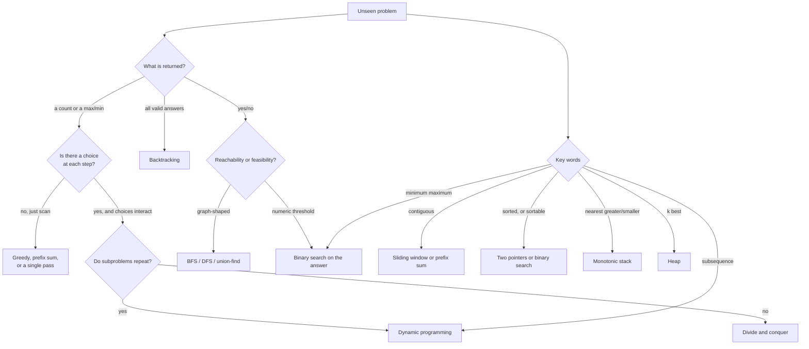

# How to think

> **The one sentence:** you are not trying to *remember* a solution — you are
> trying to notice what work is being repeated, because every optimisation in
> this entire subject is the removal of repeated work.

That is the whole method. Everything below is a way of making that noticing
reliable rather than lucky.

---

## Why to think before coding

Coding early feels productive and is the main reason people stall. Three
concrete costs:

1. **You solve the wrong problem.** Half the failed attempts in practice are a
   misread constraint, not a missing algorithm.
2. **You lose the baseline.** Without the brute force stated, you have nothing
   to improve *from*, and no way to see what is repeated.
3. **You cannot narrate.** In an interview, silence while coding is scored badly
   — and you cannot explain a plan you never made.

**Five minutes of thinking routinely saves twenty minutes of debugging.** That
ratio is why the time box in [how to practise](how-to-practise.html) allocates
the first eight minutes to not writing code.

---

## Where to look — in this order

The information is always in the same four places, and most people read only the
first.

```
   1. THE OUTPUT TYPE        what am I returning?
                             a number? a boolean? one item? all items?
                             -> "all items" means backtracking or a scan;
                                "the best one" means greedy, DP or a heap

   2. THE CONSTRAINTS        n <= ?   values <= ?   negatives allowed?
                             -> tells you the intended COMPLEXITY before
                                you have had a single idea

   3. THE EXAMPLES           work the given example BY HAND, slowly
                             -> where you see the structure. Most insights
                                arrive here, not from staring at the statement

   4. THE WORDS              "contiguous", "subsequence", "sorted", "distinct",
                             "minimum maximum", "at most k"
                             -> each is a near-deterministic pattern signal
```

**Number 3 is the one people skip and it is where the answers are.** Working
`[3,2,1,5,6,4], k=2` by hand for two minutes teaches you more than re-reading
the statement five times.

---

## The five questions

Ask these in order, out loud, before writing anything.

### 1 · What exactly am I given, and what exactly must I return?

Restate it in your own words. If you cannot restate it, you have not read it.

> *"I'm given an array of integers, possibly with duplicates and negatives, and
> I return the count of contiguous subarrays summing to k. Not the subarrays
> themselves — the count."*

### 2 · What does the brute force look like, and what does it cost?

Always. Even when it is obviously too slow.

> *"For every start, for every end, sum the range and compare. That is O(n³), or
> O(n²) if I accumulate as I extend."*

### 3 · **What work am I repeating?**

**This is the question that produces the answer.** Every optimisation in this
subject is the elimination of repeated work.

> *"For each new end index, I am re-summing a range I have almost entirely
> summed already. And across different starts, I recompute the same prefixes
> over and over."*

### 4 · What could I remember to avoid repeating it?

The repeated work names the data structure.

| What is repeated | What to remember | Structure |
|---|---|---|
| "have I seen this before?" | The set of things seen | `set` / `dict` |
| "what is the total up to here?" | Running prefix sums | `dict` of prefix → count |
| "what is the smallest so far?" | The running minimum | A variable, or a heap |
| "what is the nearest bigger element?" | Unresolved candidates | Monotonic stack |
| "what is the answer for a smaller input?" | Subproblem results | Memo / DP table |
| "which of these k is smallest?" | The k best | Heap |

### 5 · Does my answer meet the constraint budget?

Check it against the bound *before* coding, not after it times out.

> *"n ≤ 10⁵ so I need O(n) or O(n log n). Prefix sum with a hash map is O(n).
> Good."*

---

## The decision tree

When the five questions do not immediately resolve it, this narrows fast.



**Start from the word cues on the right.** They are faster and more reliable
than reasoning down from the output type, and they resolve most problems in
under thirty seconds.

---

## The flow of learning

Understanding a pattern is not binary. It moves through four stages, and knowing
which stage you are in tells you what to do next.

```
   STAGE 1   CONFUSED
             You read the solution and it makes sense, but you could not
             have produced it. You cannot say WHY it works.
             -> Do NOT move on. Re-derive it tomorrow from a blank file.

   STAGE 2   RECOGNITION WITH HELP
             You see the pattern once someone names it, or once you have
             read the first line of the approach.
             -> Solve five more of the SAME pattern. Do not vary yet.

   STAGE 3   RECOGNITION UNAIDED
             You read the statement and the pattern arrives within a minute.
             Implementation still has bugs.
             -> Now vary. Mix patterns. Type templates from memory.

   STAGE 4   AUTOMATIC
             You see the cue, the template appears, and your attention is
             free for the EDGE CASES and the EXPLANATION.
             -> This is the target. It is where interviews are passed.
```

**The mistake is treating stage 1 as stage 3.** Reading a solution and nodding
produces the *feeling* of stage 3 with the *ability* of stage 1, and the gap only
becomes visible under interview pressure — which is exactly the wrong time.

**The test for which stage you are in:** open a blank file and solve it with no
reference. Not "could I follow the solution" — *could I produce it*.

---

## How a single problem should progress

The same problem, revisited, teaches something different each time.

| Pass | What you are doing | What you learn |
|---|---|---|
| **1st** | Struggling, then reading the solution | That the pattern exists |
| **2nd** (next day) | Re-deriving from memory | Where your understanding is thin |
| **3rd** (a week later) | Solving it cold | Whether it is actually yours |
| **4th** | Solving a *variant* | Whether you learned the pattern or the problem |
| **5th** | Explaining it out loud to someone | Whether you understand it at all |

**Pass 5 is the strongest test and the least used.** Explaining forces you to
make the reasoning explicit, and the places you go vague are exactly the places
you do not understand.

---

## What to do when you are stuck at each stage

| Stuck on | Symptom | Do this |
|---|---|---|
| **Understanding** | Cannot restate the problem | Work the example by hand, exhaustively, on paper |
| **Recognition** | No pattern comes to mind | Go through the word cues. Ask "what am I repeating?" |
| **Approach** | Pattern known, cannot apply it | Write the brute force. The optimisation is a delta from it |
| **Implementation** | Approach clear, code wrong | Write the template first, then adapt. Do not improvise |
| **Edge cases** | Works on the example, fails hidden tests | Empty, single, duplicates, all-same, maximum size, negatives |
| **Complexity** | Cannot state the cost | Count operations per element, times the number of elements |

---

## Three habits worth more than a hundred problems

**1 · Always state the brute force.** It costs twenty seconds, gives you a
baseline, and is where the repeated work becomes visible. It is also scored
directly in interviews.

**2 · Read the constraints before thinking.** They tell you the intended
complexity, which eliminates most approaches before you consider them. This is
the habit competitive programmers have and interview candidates usually do not.

**3 · Say what you would measure.** *"If this is too slow, the thing to check is
whether the inner loop actually runs O(n) times or amortises."* Thinking in terms
of what would falsify your reasoning is the difference between an answer and a
guess — and it is the same instinct that makes a good engineer.

---

## The one-page summary

```
   BEFORE CODING
     read output type -> read constraints -> work the example by hand
     restate the problem in your own words
     state the brute force and its cost
     ask: WHAT AM I REPEATING?
     name what you would remember to avoid repeating it
     check the complexity against the constraint budget

   WHILE CODING
     write the template first, then adapt
     narrate every block in one sentence
     name variables for what they MEAN, not i and j

   AFTER CODING
     trace one small example by hand
     test: empty, single, duplicates, all-same, max size, negatives
     state time and space, and what dominates
     say what you would do differently with more time
```

If you internalise one line from this page, make it the middle one: **what am I
repeating?** Every technique in this handbook is an answer to that question.
