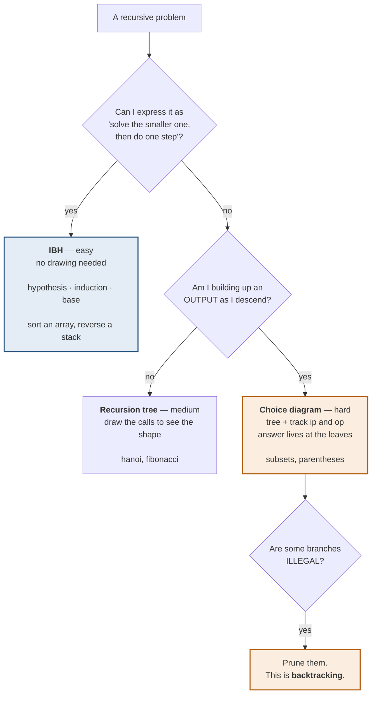
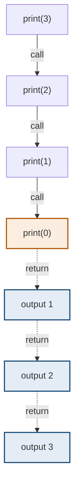
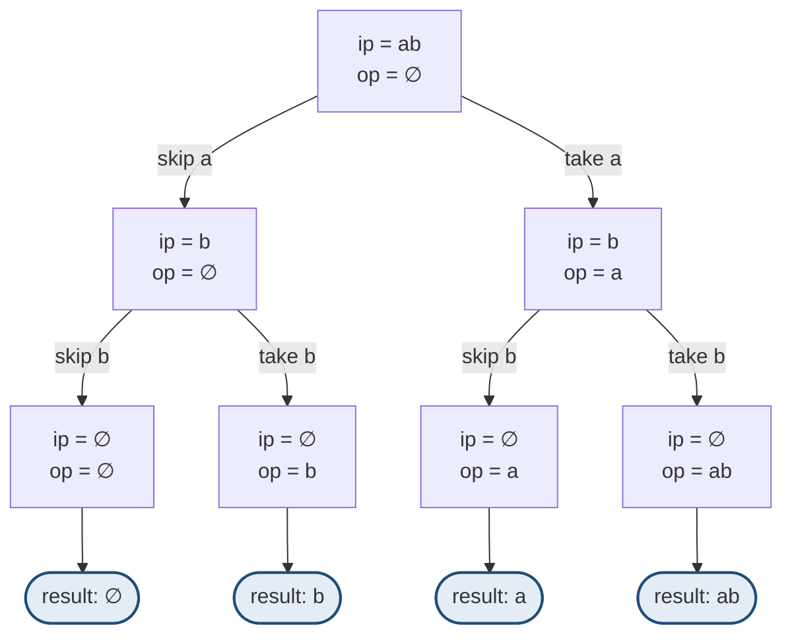
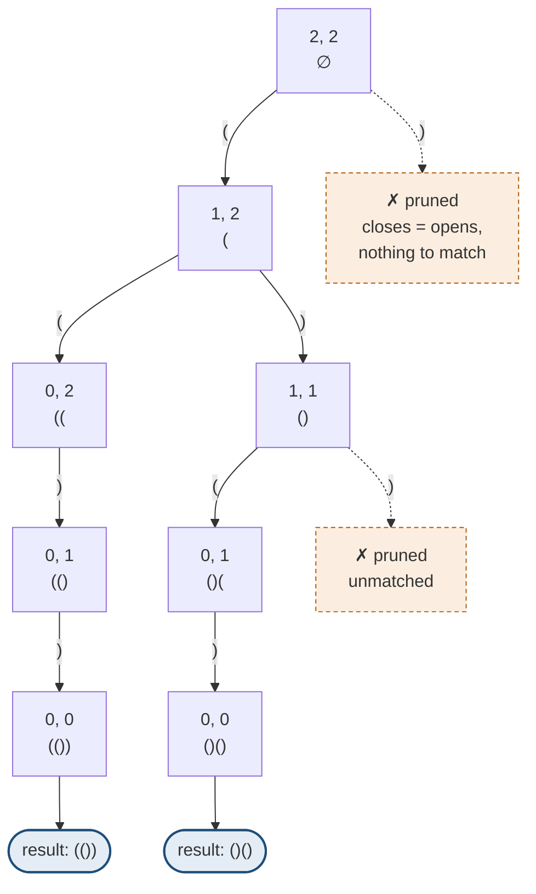
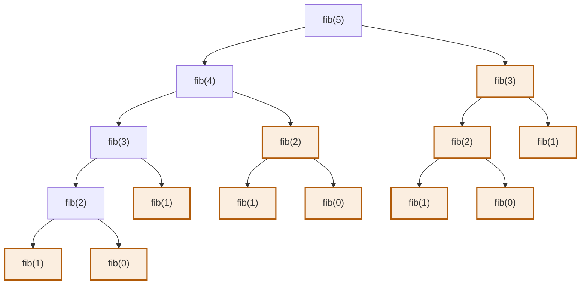
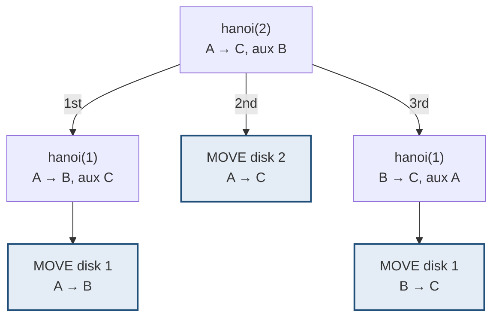

# How to draw a recursion tree

> **The recursion tree is not a study aid. It is the construction method.** You
> draw the tree, and the code is read off it. Everything else on these pages
> depends on being able to do this.

**Every diagram below was generated by actually running the code** — not drawn
from memory. The call order, the return order and the pruned branches are what
the machine really does.

---

## 0 · Three methods, not two

**There are three tools here, and they form a difficulty ladder.** Earlier pages
in this handbook treated the tree and the choice diagram as one thing; they are
not.

| Difficulty | Method | What you actually do |
|---|---|---|
| **Easy** | **IBH** | Answer three questions. **No picture needed** — hypothesis, induction, base condition, and write the code |
| **Medium** | **Recursion tree** | You cannot see it in your head, so **draw the call tree** to find the structure and the base case |
| **Hard** | **Choice diagram (IP–OP)** | The tree alone is not enough — you must also track **what input is left and what output is built** at every node |



> ⚠️ **The easy/medium/hard mapping above is reported to me, not verified from
> the videos.** The three methods are real and distinct; whether the series
> presents them as a difficulty ladder in exactly these words is something to
> confirm as you watch. The rest of this page — the trees themselves — is
> generated from executed code and is reliable.

**Why the distinction is worth keeping:** the choice diagram is a *recursion tree
plus bookkeeping*. Every choice diagram is a recursion tree; not every recursion
tree needs the two boxes. Fibonacci and Hanoi have trees but no `op` to carry —
there is nothing being built up, only values returning. Subsets and parentheses
have both.

| | Recursion tree | Choice diagram |
|---|---|---|
| Shows | Which calls happen | Which calls happen **+ state at each node** |
| Node label | The arguments | `ip` (left to decide) and `op` (built so far) |
| Answer lives | In the return values, coming up | **At the leaves**, in `op` |
| Use for | Hanoi, Fibonacci, any recursion | Subsets, permutations, parentheses |

---

## 1 · What a recursion tree is

```
ONE NODE  =  one function call, with its arguments
ONE EDGE  =  one call made from inside another
A LEAF    =  a call that hits the base case and returns without recursing
DEPTH     =  how deep the call stack gets
WIDTH     =  how many calls exist at one level
```

That is the entire vocabulary. The tree is a picture of *which calls happen*,
and its shape tells you the complexity for free.

**Two directions matter, and confusing them is the most common bug:**

```
   DOWN the tree (calls)          UP the tree (returns)
   ------------------------       -----------------------
   arguments get smaller          values come back
   code BEFORE the recursive      code AFTER the recursive
   call runs here                 call runs here
```

---

## 2 · The five-step procedure

**Do this on paper before typing anything.**

```
1. PICK A TINY INPUT.  n = 2 or 3, or a 2-character string.
   Never n = 5. You will run out of paper and lose the pattern.

2. WRITE THE ROOT.  The original call, with its real arguments.

3. FROM THAT NODE, ASK: "what calls does this make?"
   Draw one edge per call. Label each edge with the DECISION it
   represents ("take a", "skip a", "n-1").

4. REPEAT until every branch reaches a node that makes no further
   call. Those are your leaves -- and THAT CONDITION IS YOUR BASE CASE.
   You did not have to guess it.

5. READ THE CODE OFF ONE NODE.  Look at a single internal node: its
   outgoing edges ARE the body of your function, in order.
```

> **Step 4 is why you draw the tree.** People try to derive the base case in
> their head and get it wrong. On paper it is simply "where the picture stops",
> which requires no cleverness at all.

---

## 3 · A chain — print 1 to N

The simplest tree: **one child per node, so it is a chain, not a branching
tree.** No decision is made anywhere.

```python
def print_1_to_n(n):
    if n == 0: return
    print_1_to_n(n - 1)
    print(n)
```

**The real trace for `n = 3`:**

```
print_1_to_n(3)                 <- call goes DOWN
  print_1_to_n(2)
    print_1_to_n(1)
      print_1_to_n(0)
        base, return            <- bottom reached
      OUTPUT 1                  <- now unwinding, work happens UP
    OUTPUT 2
  OUTPUT 3

output: 1 2 3
```

**As a tree** — a chain, with both directions marked:



**Solid edges go down (the calls); dashed edges come back up (the output).**
Every call happens before any printing does.

> **Move `print(n)` above the recursive call and the output reverses to 3 2 1**,
> because the work now happens on the way down instead of on the way up. Same
> tree, opposite traversal. **This is the single most important thing the tree
> shows you.**

---

## 4 · A branching tree — subsets

Two calls per node, so the tree doubles at every level: **2ⁿ leaves.**

```python
def solve(ip, op):
    if not ip:
        results.append(op); return
    solve(ip[1:], op)            # skip ip[0]
    solve(ip[1:], op + ip[0])    # take ip[0]
```

**The real trace for `"ab"`** — note the skip branch runs first:

```
solve(ip='ab', op='')
  solve(ip='b',  op='')          <- skip 'a'
    solve(ip='', op='')            LEAF -> ''
    solve(ip='', op='b')           LEAF -> 'b'
  solve(ip='b',  op='a')         <- take 'a'
    solve(ip='', op='a')           LEAF -> 'a'
    solve(ip='', op='ab')          LEAF -> 'ab'
```

**As a tree** — every node carries two boxes: `ip` shrinking, `op` growing.



**Leaves left to right: `∅`, `b`, `a`, `ab`.** The skip branch is drawn first
because it is called first — which is exactly the output order.

**Three things to read straight off it:**

| Read | Value |
|---|---|
| Base case | `ip` is empty — the leaves |
| Number of results | 2ⁿ — one per leaf |
| Order of results | Left branch first, so skips come before takes |

**The two boxes per node are the whole input–output method:** `ip` shrinks as you
descend, `op` grows. At a leaf, `ip` is empty and `op` is one answer.

---

## 5 · A pruned tree — balanced parentheses

Same branching shape, but **some branches are illegal and must not be drawn.**
That is what makes it backtracking.

```python
def solve(open_left, close_left, cur):
    if open_left == 0 and close_left == 0:
        results.append(cur); return
    if open_left > 0:
        solve(open_left - 1, close_left, cur + "(")
    if close_left > open_left:
        solve(open_left, close_left - 1, cur + ")")
```

**The real trace for `n = 2`, pruned branches marked `x`:**

```
(2,2,'')
  (1,2,'(')
    (0,2,'((')
      x  '(' pruned -- no opens left
      (0,1,'(()')
        x  '(' pruned
        (0,0,'(())')   LEAF -> '(())'
    (1,1,'()')
      (0,1,'()(')
        x  '(' pruned
        (0,0,'()()')   LEAF -> '()()'
      x  ')' PRUNED -- would be unmatched
  x  ')' PRUNED -- would be unmatched
```

**As a tree, with the dead branches drawn in** — nodes are
`(opens left, closes left, string so far)`:



**Two leaves out of a space of 16 possible 4-character strings.** The dashed
branches are the ones the guard kills before they are ever explored.

> **The root's right branch is pruned immediately.** Starting with `)` is
> invalid, and the guard `close_left > open_left` is false at the root because
> they are equal. **Pruning at the root is what stops the tree being 2²ⁿ.**

**Without the guard you would generate all 2⁴ = 16 strings and filter.** With it,
you generate 2. That difference *is* backtracking.

---

## 6 · A tree with repeated work — Fibonacci

**The tree that explains why dynamic programming exists.**

```python
def fib(n):
    if n <= 1: return n
    return fib(n - 1) + fib(n - 2)
```

**Real call counts for `fib(5)`:**

```
fib(5)
  fib(4)
    fib(3)
      fib(2)
        fib(1)
        fib(0)
      fib(1)
    fib(2)          <- fib(2) AGAIN
      fib(1)
      fib(0)
  fib(3)            <- fib(3) AGAIN, entire subtree recomputed
    fib(2)
      fib(1)
      fib(0)

call counts:  fib(0)x3   fib(1)x5   fib(2)x3   fib(3)x2   fib(4)x1   fib(5)x1
```

**Fifteen calls to compute six distinct values.**

**As a tree** — every shaded node is a value already computed somewhere else:



**`fib(3)` is computed twice, `fib(2)` three times, `fib(1)` five times.** The
entire right subtree under `fib(5)` duplicates work already done on the left.

> **The tree makes the diagnosis obvious: identical nodes appear in more than one
> place.** That is the definition of *overlapping subproblems*, and it is the
> precise signal that recursion should become
> [dynamic programming](dynamic-programming.html). Cache each node and the tree
> collapses from 2ⁿ to n.
>
> **Contrast with the subsets tree**: every node there is distinct — different
> `(ip, op)` pairs — so there is nothing to cache and memoisation would not help.
> **Drawing the tree is how you tell those two cases apart.**

---

## 7 · A tree with rotating roles — Tower of Hanoi

Two recursive calls, and **the arguments swap roles between them.**

```python
def hanoi(n, src, aux, dst):
    if n == 0: return
    hanoi(n - 1, src, dst, aux)     # note: dst is used AS the auxiliary
    print(f"move disk {n}: {src} -> {dst}")
    hanoi(n - 1, aux, src, dst)     # note: src is used AS the auxiliary
```

**Real trace for `n = 2`, moving A → C:**

```
hanoi(2, A->C, aux=B)
  hanoi(1, A->B, aux=C)          <- get the small disk out of the way
    MOVE disk 1: A -> B
  MOVE disk 2: A -> C            <- the real move, between the two calls
  hanoi(1, B->C, aux=A)          <- put it back on top
    MOVE disk 1: B -> C

moves: A->B, A->C, B->C   (3 moves = 2^2 - 1)
```

**As a tree** — note the work sits in the *middle* child, not at the end:



**Reading the moves left to right gives `A→B`, `A→C`, `B→C`** — 3 moves,
which is 2² − 1.

> **The work sits *between* the two recursive calls**, not before or after both.
> That is a third position — neither "on the way down" nor "on the way up" — and
> the tree is the only way to see it clearly.
>
> **Watch the roles rotate.** In the first call the destination `C` serves as
> the auxiliary; in the second, the source `A` does. Getting that rotation right
> is the entire problem.

---

## 8 · Reading complexity off the tree

You never need a recurrence relation for these.

```
TIME  =  (number of nodes)  x  (work done at each node)
SPACE =  (depth of the tree)      <- the call stack
```

| Tree shape | Nodes | Time | Stack |
|---|---|---|---|
| Chain (print 1 to N) | n | O(n) | O(n) |
| Binary, depth n (subsets) | 2ⁿ⁺¹−1 | O(2ⁿ) | O(n) |
| Binary with copying (subsets, string ops) | 2ⁿ | O(2ⁿ · n) | O(n) |
| Fibonacci | ~2ⁿ | O(2ⁿ) | O(n) |
| Fibonacci + memo | n | O(n) | O(n) |
| Hanoi | 2ⁿ−1 | O(2ⁿ) | O(n) |
| Permutations | n! leaves | O(n! · n) | O(n) |

> **Depth and node count are different things**, and mixing them up is the usual
> error. The subsets tree has 2ⁿ nodes but only depth n — so it is exponential in
> *time* and linear in *stack space*. Saying that distinctly in an interview is
> worth real credit.

---

## 9 · Failure modes

| Mistake | What happens | Fix |
|---|---|---|
| Drawing for n = 5 | Runs off the page, pattern lost | **n = 2 or 3. Always.** |
| Unlabelled edges | Cannot tell which call is which | Label every edge with its decision |
| Skipping the base case row | You guess it and get it wrong | The leaves *are* the base case |
| Ignoring call order | Wrong output order | Left branch runs fully before the right |
| Confusing down with up | Output reversed | Before the call = down; after = up |
| Not noticing repeated nodes | Exponential code that should be DP | Look for identical labels in two places |
| Drawing pruned branches as real | Wrong complexity, wrong results | Mark illegal branches `x` and stop |

---

## 10 · The one-minute drill

Given any recursive problem:

```
[ ] Tiny input -- n=2 or a 2-character string
[ ] Root node with real arguments
[ ] One edge per call, each edge LABELLED
[ ] Expand until nothing recurses -> those leaves are the base case
[ ] Any node appear twice?  -> memoise, it is DP
[ ] Any branch illegal?     -> prune it, it is backtracking
[ ] Work before or after the call? -> that fixes your output order
[ ] Count nodes -> time.  Count depth -> stack.
```

---

## Stop condition

You can do this when you can:

1. draw the subsets tree for a 2-character string from memory, with labels,
2. say which code runs on the way down and which on the way up,
3. get the base case from the leaves rather than by guessing,
4. spot overlapping subproblems in a Fibonacci tree and name the fix,
5. explain why pruning the root's right branch matters in the parentheses tree,
   and
6. read time from node count and stack from depth, separately.
